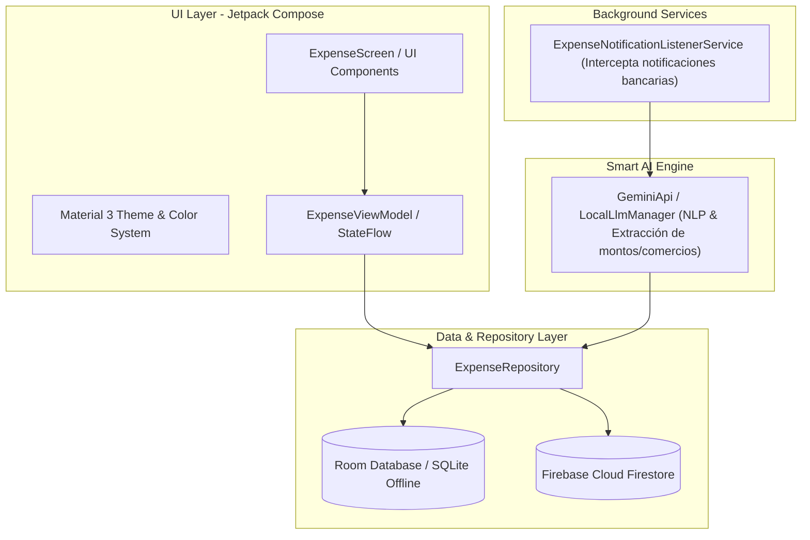

# FinanceTracker - Gestor de Finanzas con IA (Android Nativo)

[](https://kotlinlang.org/)
[](https://developer.android.com/)
[](https://developer.android.com/jetpack/compose)
[](https://developer.android.com/training/data-storage/room)
[](https://ai.google.dev/)
[](https://firebase.google.com/)
[](LICENSE)

Aplicación móvil nativa para Android desarrollada en **Kotlin** con **Jetpack Compose (Material 3)** y arquitectura **MVVM**. Integra **Inteligencia Artificial con Google Gemini** para la categorización semántica y extracción automática de gastos a partir de notificaciones bancarias mediante un **NotificationListenerService** en segundo plano, persistencia local con **Room Database** y sincronización en la nube con **Firebase**.

---

## Arquitectura del Sistema (MVVM & Clean Components)



---

## Funcionalidades Principales

- **Auto-detección y Extracción con Gemini AI:** Analiza el texto de notificaciones bancarias en tiempo real y extrae automáticamente el comercio, el monto y la categoría del gasto sin requerir entrada manual del usuario.
- **Servicio en Segundo Plano:** `ExpenseNotificationListenerService` para captura continua de alertas de pago y transferencias bancarias.
- **Interfaz de Usuario con Jetpack Compose:** Diseño declarativo moderno basado en componentes Material 3, soporte nativo de modo oscuro/claro y transiciones reactivas.
- **Persistencia Local con Room ORM:** Base de datos relacional SQLite embebida que garantiza operatividad fluida sin conexión a internet (*Offline-First*).
- **Sincronización Cloud con Firebase:** Respaldo y sincronización de datos en tiempo real entre múltiples dispositivos.
- **Testing Automatizado:** Pruebas unitarias, pruebas con **Robolectric** y tests de regresión visual con **Screenshot Testing**.

---

## Estructura del Proyecto

```
app/src/main/
├── AndroidManifest.xml
├── java/com/example/
│   ├── data/
│   │   ├── local/          # Room Database, DAOs y LocalLlmManager
│   │   ├── model/          # Entidades de datos (Expense, Category, etc.)
│   │   ├── remote/         # Clientes de API (GeminiApi)
│   │   └── repository/     # ExpenseRepository (Capa única de datos)
│   ├── service/            # ExpenseNotificationListenerService (Background)
│   ├── ui/                 # Composable Screens, ViewModel y StateFlow
│   │   └── theme/          # Sistema de diseño, paleta de colores y tipografía
│   ├── ExpenseApp.kt       # Application class
│   └── MainActivity.kt     # Activity principal Compose
└── res/                    # Drawables, mipmaps, strings, colors y XML configs
```

---

## Stack Tecnológico

- **Lenguaje:** Kotlin 2.0+
- **Framework UI:** Jetpack Compose (Material Design 3)
- **Persistencia:** Android Room ORM (SQLite)
- **Asincronía:** Kotlin Coroutines & StateFlow
- **IA & LLM:** Google Gemini API (Generative AI Client)
- **Servicios Cloud:** Firebase Firestore / Authentication
- **Pruebas:** JUnit 4, Robolectric, Screenshot Testing Framework

---

## Guía de Instalación y Ejecución

### Prerrequisitos
- [Android Studio Ladybug / Koala o superior](https://developer.android.com/studio).
- JDK 17 o superior.
- Dispositivo físico con Android 8.0+ (API 26+) o Emulador Android configurado.

### 1. Clonar el Repositorio
```bash
git clone https://github.com/Angelblazel/financetracker-android-kotlin.git
cd financetracker-android-kotlin
```

### 2. Configurar Clave de API de Gemini
Crea o edita el archivo `local.properties` en la raíz del proyecto y agrega tu API Key de Google AI Studio:
```properties
GEMINI_API_KEY="AIzaSy..."
```

### 3. Compilar y Ejecutar
1. Abre el proyecto en **Android Studio**.
2. Permite que Gradle sincronice las dependencias (`Sync Project with Gradle Files`).
3. Selecciona tu emulador o dispositivo físico y presiona **Run (`Shift + F10`)**.
4. Concede el permiso de acceso a notificaciones en los ajustes de Android para habilitar la auto-captura inteligente de gastos.
